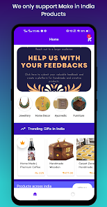

# E-Commerce App

## Setup

### Requirement

- Java 17.0.9: You can download [here](https://www.oracle.com/java/technologies/javase/jdk17-archive-downloads.html)

- Android drive API 34 (Android 14.0)

## Features

- **Product Categories:** Browse a variety of handmade products conveniently categorized for easy navigation.
- **User Authentication:** Secure user accounts with Firebase Authentication ensure a personalized experience.
- **Product Details:** Get detailed information about each product, including images, descriptions, and pricing.
- **Shopping Cart:** Add products to your cart and manage your shopping list effortlessly.
- **Order History:** Keep track of your previous orders and review your purchase history.
- **Real-time Updates:** Firebase Realtime Database ensures that product listings and user data are always up-to-date.

## Screenshots

<table>

  <tr>
    <td> </td>
    <td> </td>
    <td> </td>

  </tr>
 </table>

## Configure Firebase 👀

- Create your own project on firebase.
- download google-services.json
- Place it in the app folder
- Setup Realtime database in firebase and enable the database by setting true to read & write in the rules tab of relatime database.
- Setup Storage in firebase and enable it by setting true to read and write in the rules of storage.
- Setup authentication in firebase and enable email/password authentication.
- You are good to go.👌👌
